# 거기 지금 사람 많아요?

## 서비스 소개

특정 관광지에 현재 사람이 많은지를 확인해 혼잡도와 예상 대기 시간을 알려주는 서비스입니다.

관광지 정보를 얻도록 만들었으나, 사람이 많이 몰릴 수 있는 병원, 은행 등의 시설이나 인생네컷과 같은 셀프 사진 부스의 정보를 얻는 데도 이용할 수 있다면 유용할 것이라 생각했습니다.

## 역할

프론트엔드 개발자 2명, 백엔드 개발자 2명으로 팀을 구성했습니다.

프론트엔드 파트에서 화면을 구상하고 실제 페이지로 만들었습니다. 프론트엔드 파트 노트북이 한 대뿐이라, 대부분의 코드를 제가 작성했습니다.

시작 페이지, 지역 선택 페이지, 관광지 목록 페이지, 혼잡 정도 페이지, 상세 보기 페이지를 개발했습니다.

모바일, 태블릿, 데스크탑 등 다양한 환경에서 편하게 사용할 수 있도록 반응형 웹으로 제작했습니다.

HTML, CSS, JavaScript를 사용했습니다.

## 이슈

백엔드 팀에서 인공지능을 이용해 혼잡도를 파악하는 코드를 개발하였으나, 해커톤 당시 가져온 노트북에서 실제로 실행하긴 어렵다고 하여, 프론트엔드와 연결하지 못했습니다.

이에 '부산' - '광안리 해수욕장'을 클릭하면 어떤 식으로 사용하는 서비스인지 확인할 수 있도록 만들었습니다.

## 페이지 소개

### 시작 페이지

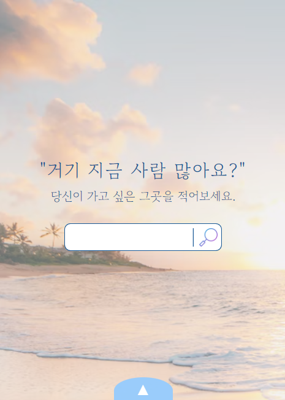

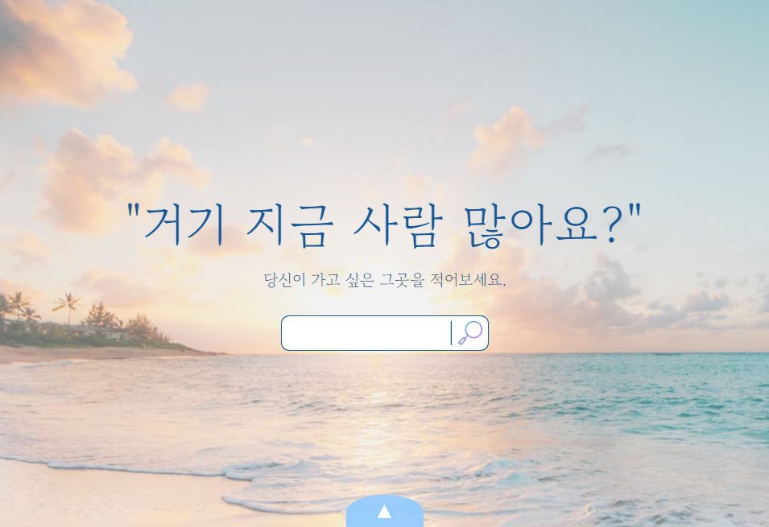

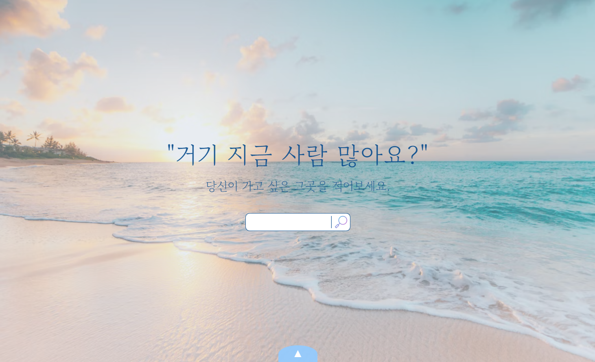

모바일, 태블릿, 데스크탑의 시작 페이지입니다.

화면 하단의 하늘색 화살표 버튼을 클릭하면 지역을 선택할 수 있는 모달창이 나타납니다.

검색으로 원하는 관광지를 찾는 게 사용자에게 편할 것이라 생각해 검색창을 만들었습니다. 실제 검색은 불가능하나, 돋보기 아이콘을 클릭하면 예시인 '광안리 해수욕장' 상세 페이지로 이동하게 했습니다.

### 선택 페이지

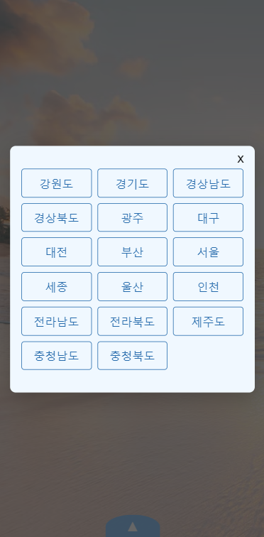

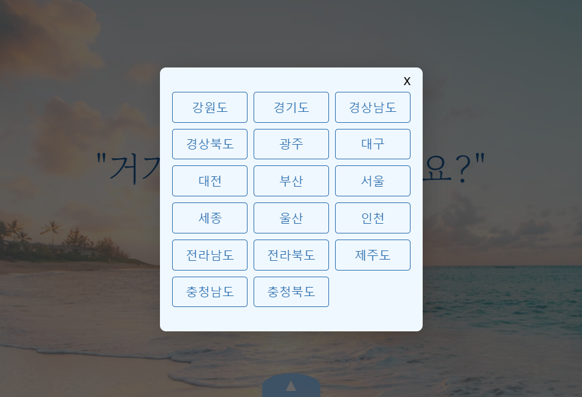

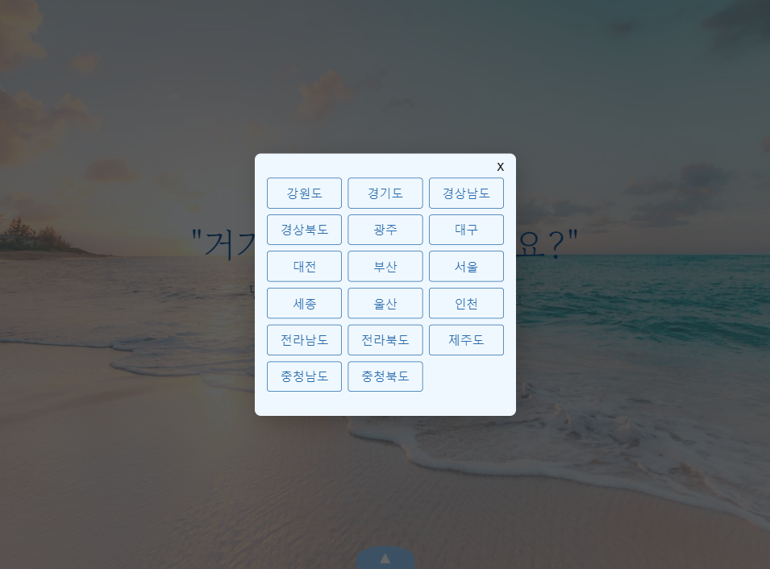

원하는 지역명 버튼을 클릭하면 해당 지역의 대표 관광지 목록이 나열된 목록 페이지로 이동합니다.

### 목록 페이지

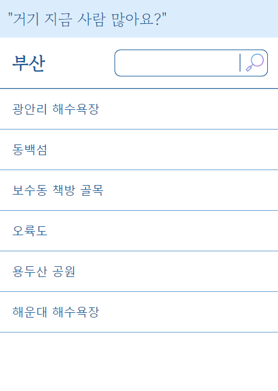

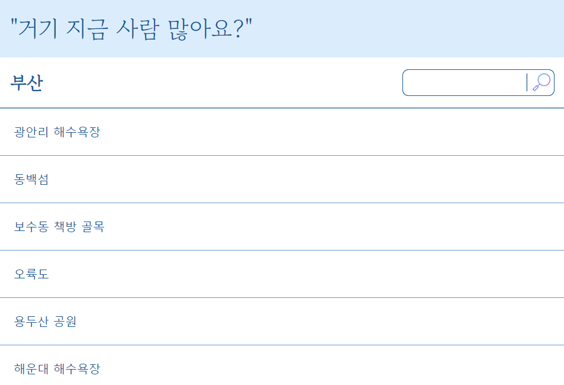

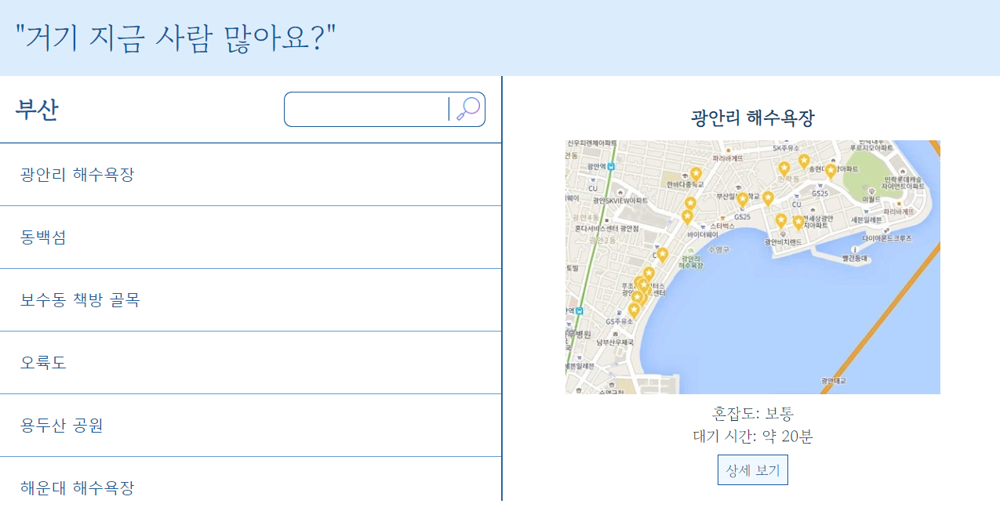

목록에서 원하는 관광지 이름을 클릭하면, 혼잡도, 예상 대기 시간, 지도, 상세 보기 버튼이 포함된 모달창이 나타납니다.

너비 1024px 이상의 디바이스에서 사용할 경우, 관광지 목록과 혼잡도 등의 정보를 한번에 확인할 수 있습니다.

### 정보 페이지

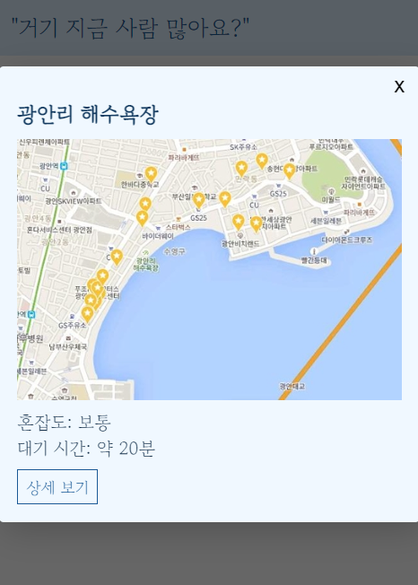

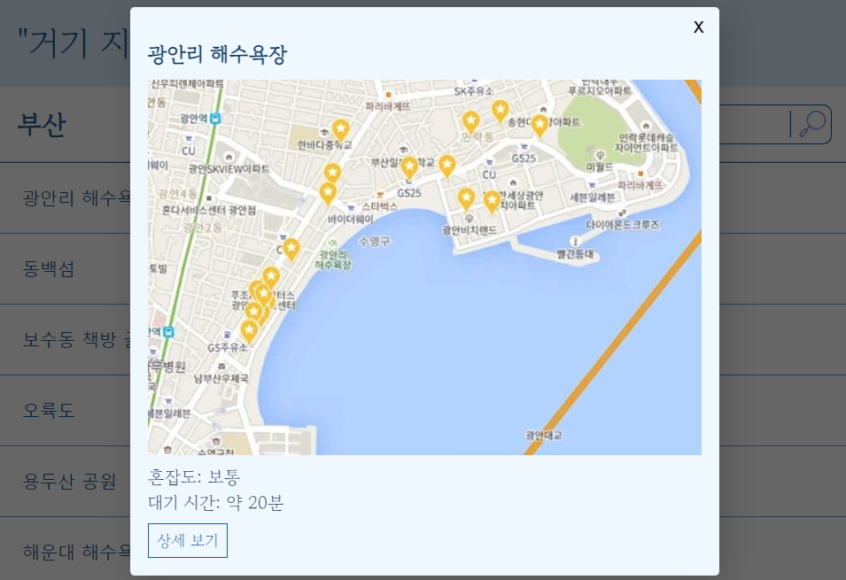

상세 보기 버튼을 클릭하면 상세 보기 페이지로 이동합니다.

### 상세 보기 페이지

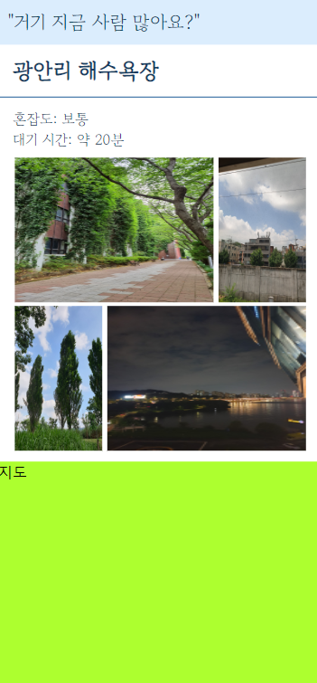

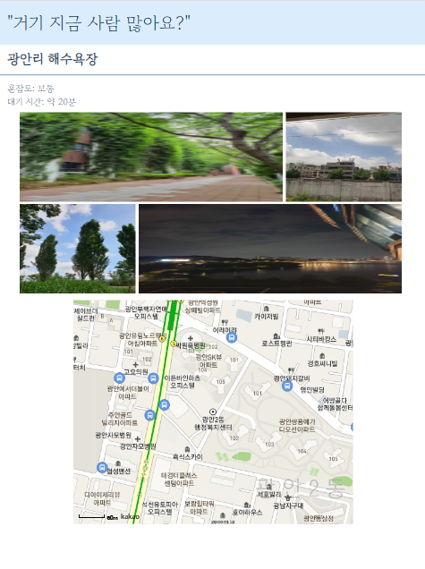

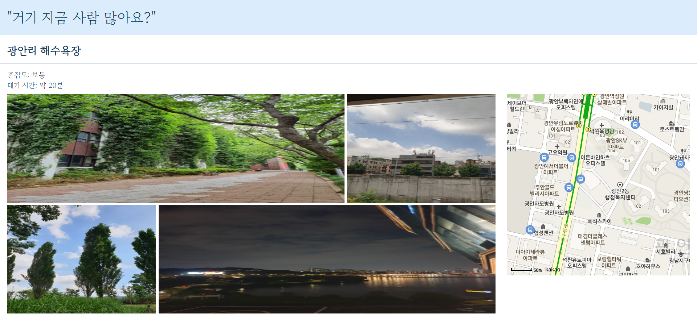

인공지능을 이용해 파악한 해당 관광지의 혼잡도와 예상 대기 시간을 가장 먼저 보여줍니다.

위의 정보와 함께 해당 관광지의 대표 사진과 지도를 확인할 수 있습니다.
